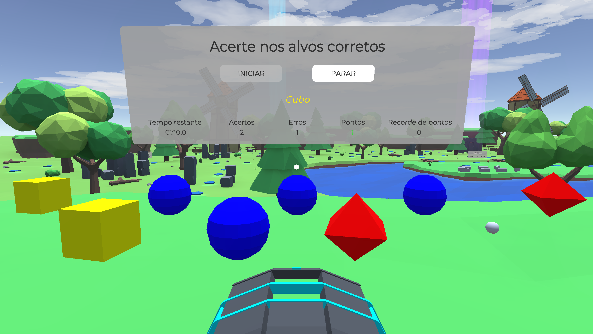
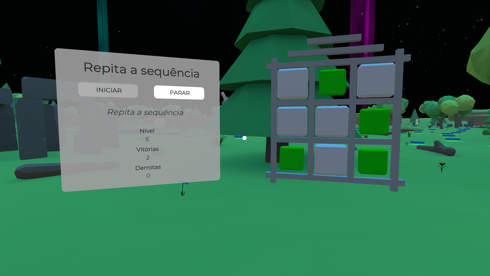
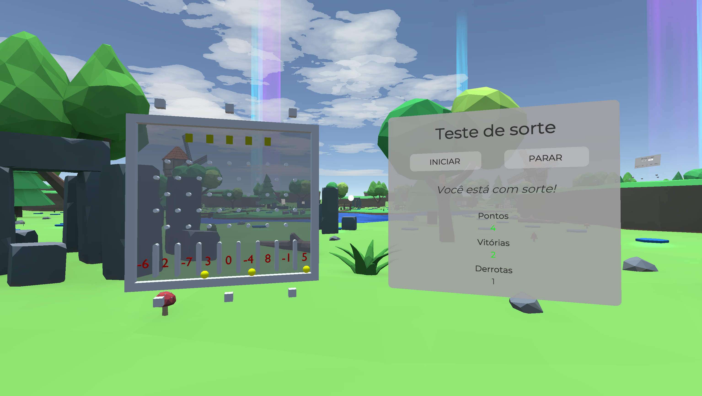
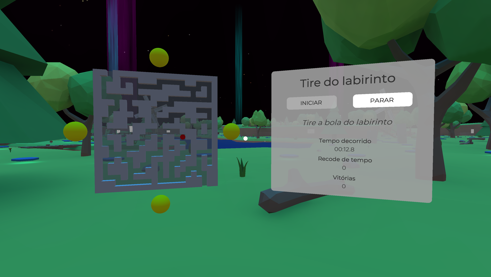
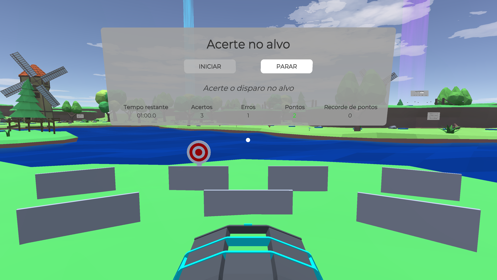
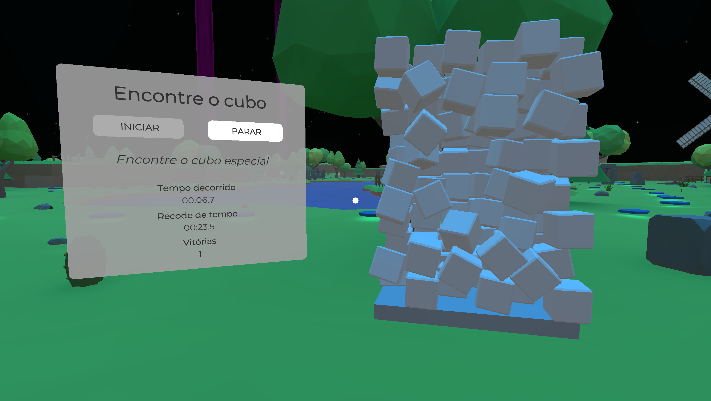
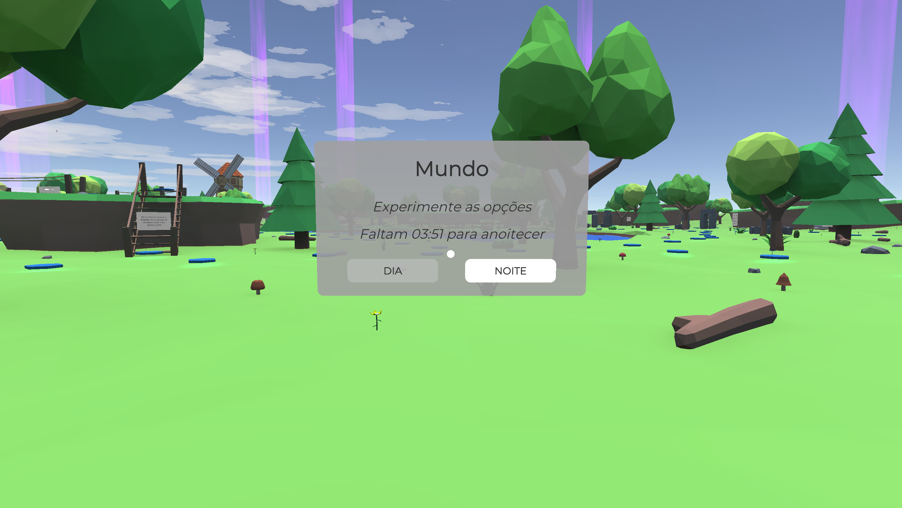

## Project VR: A Virtual Reality game for the treatment of chronic pain
The game doesn't have a name yet, as it was a course completion work project.

*Virtual Reality demonstrates potential for therapeutic treatment in patients suffering from acute and chronic pain conditions. However, interventions with Virtual Reality generally use games and/or applications not adapted for the treatment and that depend on devices that are expensive for the majority of the population. Therefore, the objective of this work was to develop a Virtual Reality game for the treatment of chronic pain, with a focus on **cognitive engagement** and **mindfulness meditation**, and aimed at smartphones. In addition, a pilot test was conducted with a physical therapist to identify their perception of the game. The results showed that the game can provide an immersive, distracting and relaxing experience. In conclusion, the game can be useful as a tool for the treatment of chronic pain, but further evaluations need to be carried out.*

#### Authors: 
- Osvaldo Henrique Cemin Becker (who developed the game)
- Ana Carolina Bertoletti De Marchi (completion work advisor)

#### Compiled for Android:
- It has the UI in Brazilian Portuguese (English to be added soon).
- It has an exploratory environment with places to unlock.
- It has 6 minigames and 1 menu to change the time of day.
- It has relaxation and meditation music.

#### Basic requirements:
- OpenGL ES 3.1 or higher
- Android 7.0 or higher
- Processor architecture ARMv7 or ARM64
- Powerful or relatively powerful smartphone (due to the big scenery in VR)
- VR headset to attach the smartphone

## Demo (Preview video [here](https://drive.google.com/file/d/1d3EjsDCcXmr3pnE5ly_4CJ6XlWGcuv13/view))

## Tools
Developed using a VRG Pro (Virtual Reality Glasses) and a Galaxy S20FE SM-G780G.

#### Softwares:
- Unity 3D with C#
- Blender
- Paint.Net
- Audacity

#### Required in the Unity project:
- Some files from Google Cardboard XR Plugin

## Assets
All 3D models were created from scratch.

#### Credits:
- Sound effects from [Mixkit](https://mixkit.co/)
- Music by [NaturesEye](https://pixabay.com/users/natureseye-18615106/) from [Pixabay](https://pixabay.com/music/)
